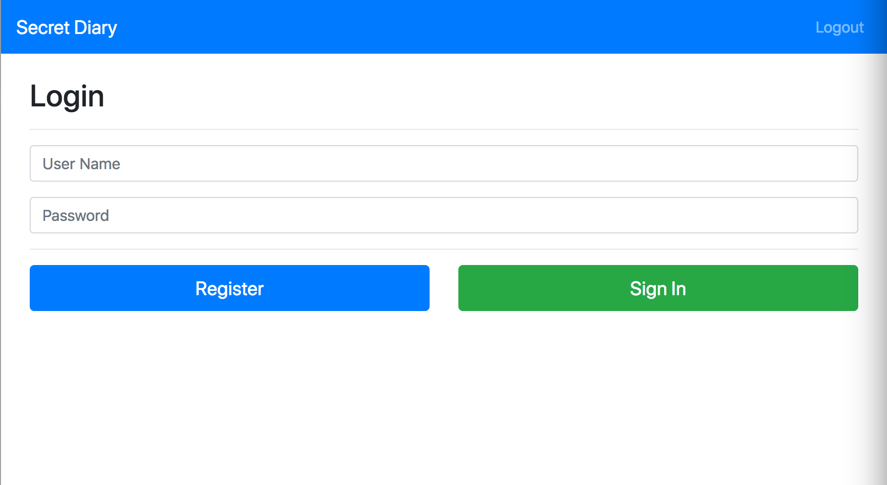
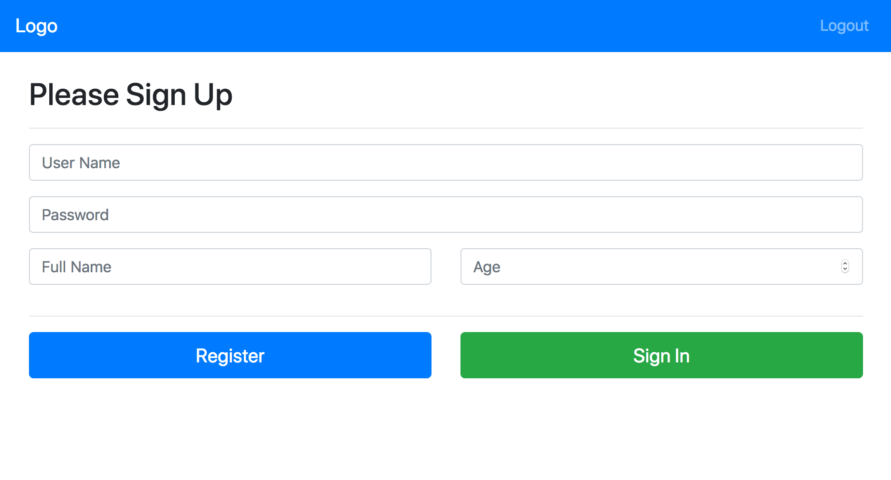
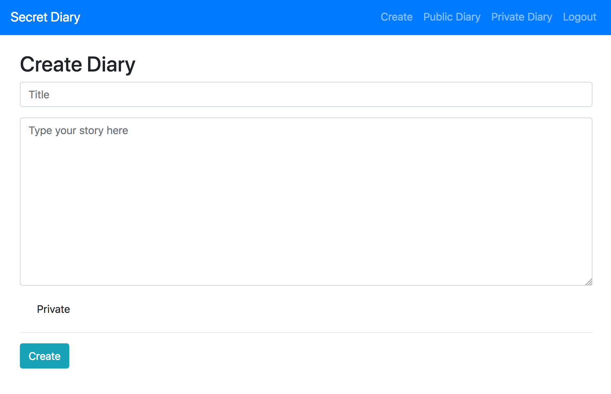
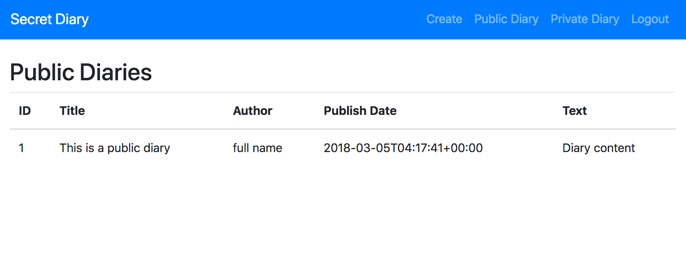
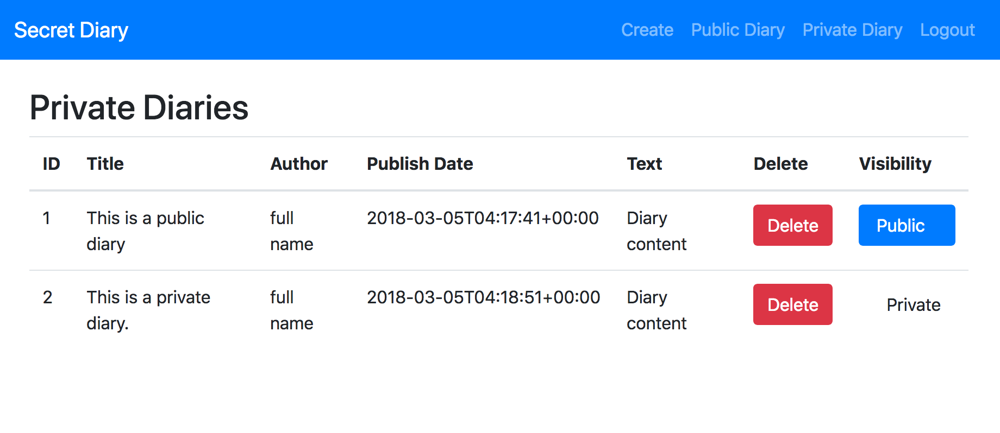

# rest-api-development

CS5331 Assignment 1 Project Reference Repository

## Screenshots

## Administration and Evaluation

Please fill out this section with details relevant to your team.

### Team Members

1.Cai Guoyuan Aaron
2.Jin Tianma
3.Rakkappan Lakshmanan
4.Sun Zelun

### Short Answer Questions

#### Question 1: Briefly describe the web technology stack used in your implementation.

Answer: 
Backend:

1. Python+Flask
2. Sqlite3
3. flask-sqlalchemy for database interaction / ORM
4. marshmallow-sqlalchemy for input validation
5. bcrypt for password hashing

Frontend:
1. JavaScript
2. HTML
3. Bootstrap 4

Security:
1. DOMPurifier

#### Question 2: Are there any security considerations your team thought about?

Implemented
1. Access Control for pages (prevent users who have not logged from accessing sensitive pages)
2. Use DOMPurifier to escape output string before displaying
3. bcrypt for password hashing, which makes use of random salt, and even with the same input, the output hash will be different. This kind of protect against brute-forcing.

Not Implemented:
1) Set timer for token expiry date 

#### Question 3: Are there any improvements you would make to the API specification to improve the security of the web application?

Answer: 
The documentation does not follow RESTful API.
E.g. The api for deleting a diary should use 'DELETE' method instead of 'POST' 
and the api for changing permission should use 'PUT' method instead of 'POST'

#### Question 4: Are there any additional features you would like to highlight?

Answer: We have access control on front end pages, only logged in user can view create and private diary pages.

#### Question 5: Is your web application vulnerable? If yes, how and why? If not, what measures did you take to secure it?

Answer: 
Yes, there are some vulnerabilities in our web application.
1) The app does not use SSL so the website can be tampered. (MIM attack, network attacks)
2) The token is stored in localStorage which is vulnerable to XSS
3) We rely a lot on third party libraries, therefore, the website is as vulnerable as the strength of the libraries used. 
4) We rely on JavaScript to control page redirection which will encounter some issues if user's browser disabled javascript.

#### Feedback: Is there any other feedback you would like to give?

Answer: Consider to include vagrant in this assignment, since most of us are not using ubuntu OS as our daily drive, so it might be useful to introduce vm concept to kick start our assignment.  

### Declaration

#### Please declare your individual contributions to the assignment:

1. Cai Guoyuan Aaron
    - Wrote Front-end pages
    - Wrote documentation
    - Wrote RESTApi
2. Jin Tianma
    - Wrote RESTApi
    - Wrote Front-end pages
3. Rakkappan Lakshmanan
    - Wrote Front-end pages
    - Implement DOMPurifier to escape user input when displaying
    - Wrote documentation
    - Wrote RESTApi
4. Sun Zelun
    - Wrote dockerfile
    - Wrote RESTApi
    - Wrote Front-end pages
    - Designed database
    - Wrote documentation

